<!DOCTYPE html>
<html lang="es">
<head>
    <meta charset="UTF-8">
    <title>TIENDA DE TENIS ADIDAS y más</title>
    
</head>
<body style="background-color: #154360; color: white; font-family: sans-serif; margin: 0; padding: 0;">

    

        <h1 style="font-size: 60px; color: red; font-weight: bold; margin-bottom: 50px;">TENIS ADIDAS</h1>
        
        <button onclick="mostrarSeccion('pantalla-siguiente')" style="font-size: 24px; padding: 15px 40px; background-color: white; color: green; border: 2px solid white; font-weight: bold; cursor: pointer;">
            VER CATÁLOGO
        </button>
    

    

        
        <button onclick="mostrarSeccion('tienda-principal')" style="font-size: 24px; padding: 15px 48px; background-color: white; color: lime; border: 2px solid white; font-weight: bold; cursor: pointer;">
            SIGUIENTE
        </button>
    

    

        
        
"Paso a paso, siempre con estilo y comodidad"

        
Las mejores marcas y los mejores precios

        
        <button onclick="document.getElementById('contenido-catalogo').style.display='block'" 
                style="background: yellow; color: black; padding: 15px 30px; font-size: 22px; border: 3px solid black; border-radius: 10px; cursor: pointer; font-weight: bold; margin-bottom: 30px;">
            🚀 MOSTRAR PRODUCTOS
        </button>

        

            

                <h2 style="color: yellow;">HOMBRES</h2>

                

                    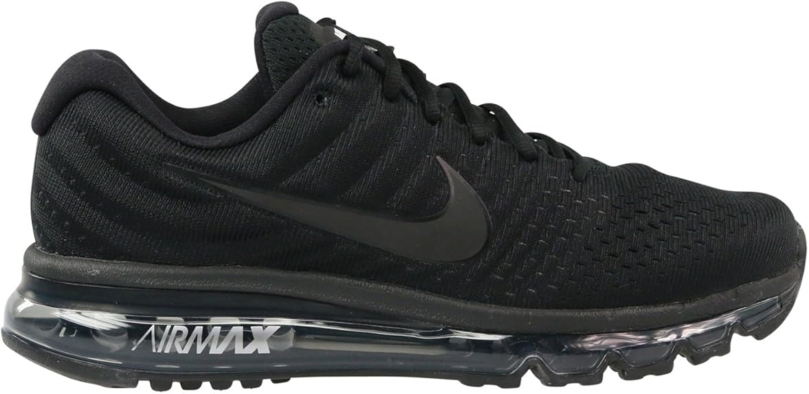 
                    <b>Nike Air Max</b> 
                    Tallas: 25 al 29 
                    <b>$2,499</b> 
                    <button onclick="agregarCarrito(2499)" style="background: orange; color: black; border: none; padding: 5px 10px; margin-top: 8px; border-radius: 5px; cursor: pointer;">🛒 AGREGAR</button>
                

                

                     
                    <b>Adidas Ultraboost</b> 
                    Tallas: 25 al 30 
                    <b>$2,299</b> 
                    <button onclick="agregarCarrito(2299)" style="background: orange; color: black; border: none; padding: 5px 10px; margin-top: 8px; border-radius: 5px; cursor: pointer;">🛒 AGREGAR</button>
                

                

                    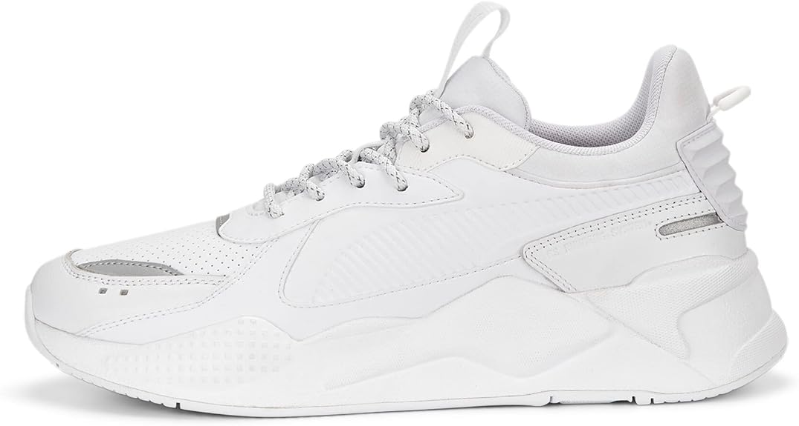 
                    <b>Puma RS-X</b> 
                    Tallas: 24.5 al 28 
                    <b>$1,850</b> 
                    <button onclick="agregarCarrito(1850)" style="background: orange; color: black; border: none; padding: 5px 10px; margin-top: 8px; border-radius: 5px; cursor: pointer;">🛒 AGREGAR</button>
                

                

                    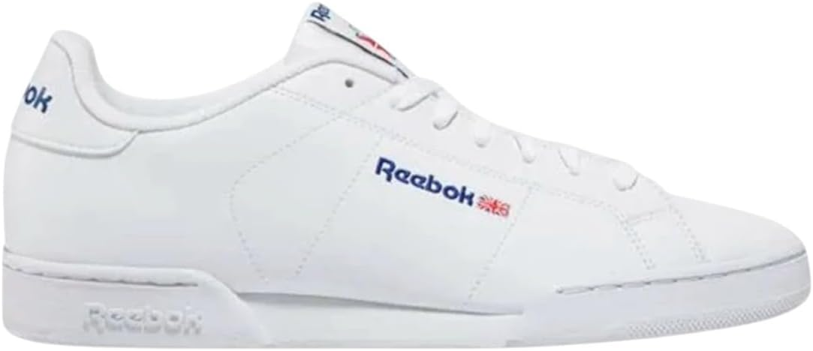 
                    <b>Reebok Classic</b> 
                    Tallas: 24 al 28 
                    <b>$1,450</b> 
                    <button onclick="agregarCarrito(1450)" style="background: orange; color: black; border: none; padding: 5px 10px; margin-top: 8px; border-radius: 5px; cursor: pointer;">🛒 AGREGAR</button>
                

                

                    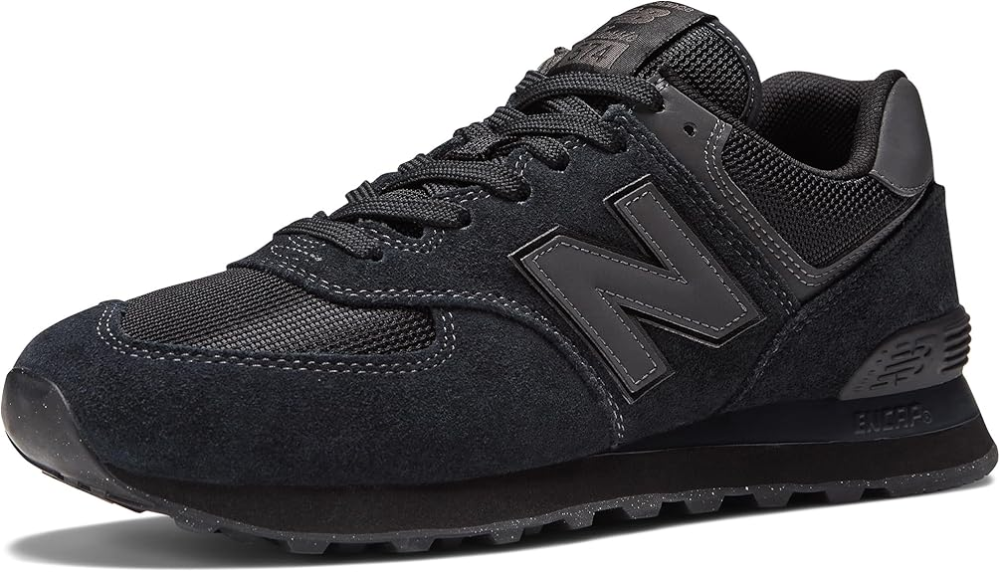 
                    <b>New Balance</b> 
                    Tallas: 25 al 29 
                    <b>$1,890</b> 
                    <button onclick="agregarCarrito(1890)" style="background: orange; color: black; border: none; padding: 5px 10px; margin-top: 8px; border-radius: 5px; cursor: pointer;">🛒 AGREGAR</button>
                

                

                    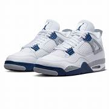 
                    <b>Jordan Retro</b> 
                    Tallas: 25 al 29 
                    <b>$2,600</b> 
                    <button onclick="agregarCarrito(2600)" style="background: orange; color: black; border: none; padding: 5px 10px; margin-top: 8px; border-radius: 5px; cursor: pointer;">🛒 AGREGAR</button>
                

            

            

                <h2 style="color: pink;">MUJERES</h2>

                

                    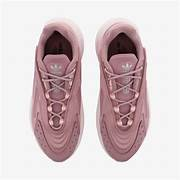 
                    <b>Adidas Ozelia</b> 
                    Tallas: 22 al 25 
                    <b>$1,999</b> 
                    <button onclick="agregarCarrito(1999)" style="background: orange; color: black; border: none; padding: 5px 10px; margin-top: 8px; border-radius: 5px; cursor: pointer;">🛒 AGREGAR</button>
                

                

                    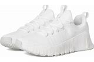 
                    <b>Nike Waffle</b> 
                    Tallas: 22.5 al 24.5 
                    <b>$1,750</b> 
                    <button onclick="agregarCarrito(1750)" style="background: orange; color: black; border: none; padding: 5px 10px; margin-top: 8px; border-radius: 5px; cursor: pointer;">🛒 AGREGAR</button>
                

                

                     
                    <b>Puma Vikky</b> 
                    Tallas: 22 al 25 
                    <b>$1,550</b> 
                    <button onclick="agregarCarrito(1550)" style="background: orange; color: black; border: none; padding: 5px 10px; margin-top: 8px; border-radius: 5px; cursor: pointer;">🛒 AGREGAR</button>
                

                

                    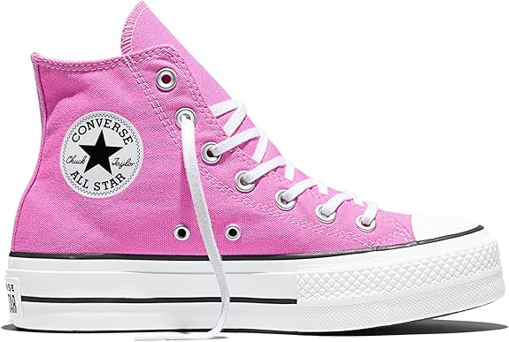 
                    <b>Converse Plataforma</b> 
                    Tallas: 22 al 25 
                    <b>$1,300</b> 
                    <button onclick="agregarCarrito(1300)" style="background: orange; color: black; border: none; padding: 5px 10px; margin-top: 8px; border-radius: 5px; cursor: pointer;">🛒 AGREGAR</button>
                

                

                    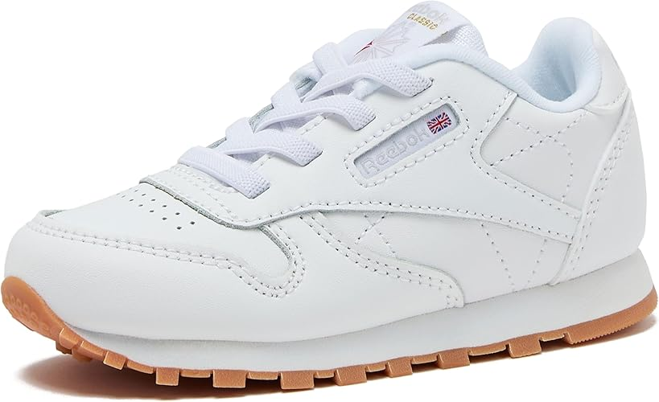 
                    <b>Vans Old Skool</b> 
                    Tallas: 22 al 25 
                    <b>$1,250</b> 
                    <button onclick="agregarCarrito(1250)" style="background: orange; color: black; border: none; padding: 5px 10px; margin-top: 8px; border-radius: 5px; cursor: pointer;">🛒 AGREGAR</button>
                

                

                     
                    <b>New Balance Rosa</b> 
                    Tallas: 22 al 25 
                    <b>$1,600</b> 
                    <button onclick="agregarCarrito(1600)" style="background: orange; color: black; border: none; padding: 5px 10px; margin-top: 8px; border-radius: 5px; cursor: pointer;">🛒 AGREGAR</button>
                

                

                    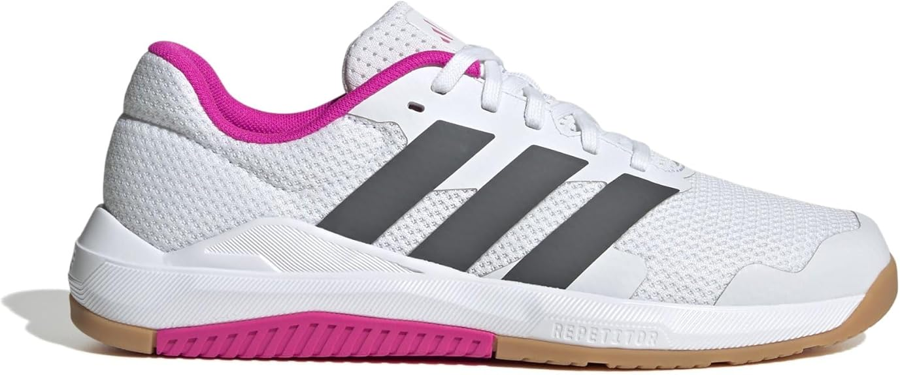 
                    <b>New Balance Morado</b> 
                    Tallas: 22 al 27 
                    <b>$1,700</b> 
                    <button onclick="agregarCarrito(1700)" style="background: orange; color: black; border: none; padding: 5px 10px; margin-top: 8px; border-radius: 5px; cursor: pointer;">🛒 AGREGAR</button>
                

            

            

                <h2 style="color: cyan;">NIÑOS</h2>

                

                    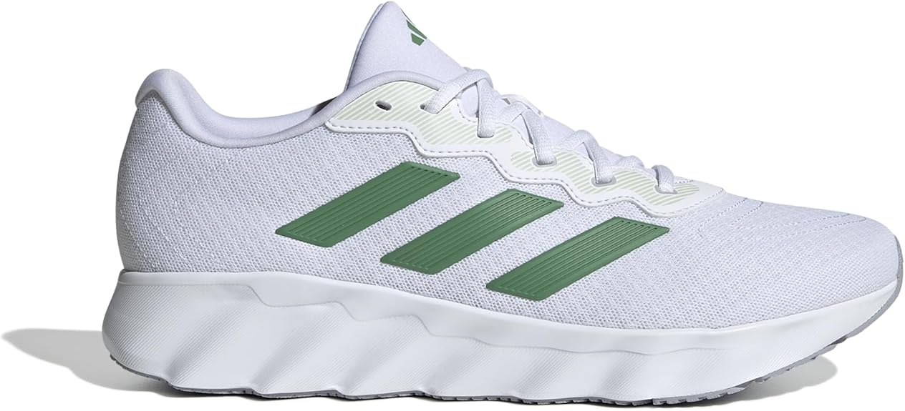 
                    <b>Adidas Tensaur</b> 
                    Tallas: 18 al 22 
                    <b>$999</b> 
                    <button onclick="agregarCarrito(999)" style="background: orange; color: black; border: none; padding: 5px 10px; margin-top: 8px; border-radius: 5px; cursor: pointer;">🛒 AGREGAR</button>
                

                

                    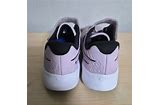 
                    <b>Nike Star Runner</b> 
                    Tallas: 17 al 21 
                    <b>$950</b> 
                    <button onclick="agregarCarrito(950)" style="background: orange; color: black; border: none; padding: 5px 10px; margin-top: 8px; border-radius: 5px; cursor: pointer;">🛒 AGREGAR</button>
                

                

                     
                    <b>Puma Stepfleex</b> 
                    Tallas: 18 al 21 
                    <b>$890</b> 
                    <button onclick="agregarCarrito(890)" style="background: orange; color: black; border: none; padding: 5px 10px; margin-top: 8px; border-radius: 5px; cursor: pointer;">🛒 AGREGAR</button>
                

                

                     
                    <b>Reebok Niño</b> 
                    Tallas: 16 al 19 
                    <b>$800</b> 
                    <button onclick="agregarCarrito(800)" style="background: orange; color: black; border: none; padding: 5px 10px; margin-top: 8px; border-radius: 5px; cursor: pointer;">🛒 AGREGAR</button>
                

                

                    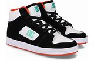 
                    <b>DC Shoes</b> 
                    Tallas: 19 al 22 
                    <b>$850</b> 
                    <button onclick="agregarCarrito(850)" style="background: orange; color: black; border: none; padding: 5px 10px; margin-top: 8px; border-radius: 5px; cursor: pointer;">🛒 AGREGAR</button>
                

                

                    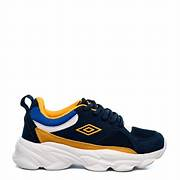 
                    <b>Umbro Niño</b> 
                    Tallas: 18 al 21 
                    <b>$700</b> 
                    <button onclick="agregarCarrito(700)" style="background: orange; color: black; border: none; padding: 5px 10px; margin-top: 8px; border-radius: 5px; cursor: pointer;">🛒 AGREGAR</button>
                

            

            

                <h2 style="color: magenta;">NIÑAS</h2>

                

                    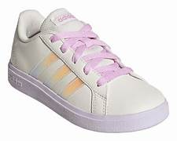 
                    <b>Adidas Grand Court</b> 
                    Tallas: 18 al 22 
                    <b>$980</b> 
                    <button onclick="agregarCarrito(980)" style="background: orange; color: black; border: none; padding: 5px 10px; margin-top: 8px; border-radius: 5px; cursor: pointer;">🛒 AGREGAR</button>
                

                

                    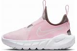 
                    <b>Nike Flex</b> 
                    Tallas: 17 al 20 
                    <b>$960</b> 
                    <button onclick="agregarCarrito(960)" style="background: orange; color: black; border: none; padding: 5px 10px; margin-top: 8px; border-radius: 5px; cursor: pointer;">🛒 AGREGAR</button>
                

                

                    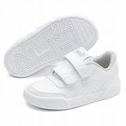 
                    <b>Puma Caracal</b> 
                    Tallas: 18 al 21 
                    <b>$900</b> 
                    <button onclick="agregarCarrito(900)" style="background: orange; color: black; border: none; padding: 5px 10px; margin-top: 8px; border-radius: 5px; cursor: pointer;">🛒 AGREGAR</button>
                

                

                    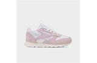 
                    <b>Reebok Rosa</b> 
                    Tallas: 16 al 19 
                    <b>$820</b> 
                    <button onclick="agregarCarrito(820)" style="background: orange; color: black; border: none; padding: 5px 10px; margin-top: 8px; border-radius: 5px; cursor: pointer;">🛒 AGREGAR</button>
                

                

                    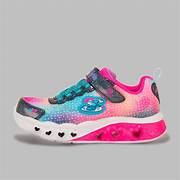 
                    <b>Skechers Niña</b> 
                    Tallas: 18 al 21 
                    <b>$950</b> 
                    <button onclick="agregarCarrito(950)" style="background: orange; color: black; border: none; padding: 5px 10px; margin-top: 8px; border-radius: 5px; cursor: pointer;">🛒 AGREGAR</button>
                

                

                    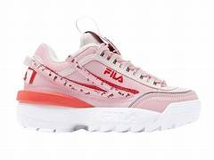 
                    <b>Fila Disruptor</b> 
                    Tallas: 19 al 22 
                    <b>$880</b> 
                    <button onclick="agregarCarrito(880)" style="background: orange; color: black; border: none; padding: 5px 10px; margin-top: 8px; border-radius: 5px; cursor: pointer;">🛒 AGREGAR</button>
                

            

              
            
            

                <h2>🛒 CARRITO</h2>
                <h3>Total: $0.00 MXN</h3>
            

              

            

                <h2>💳 PAGO CON TARJETA</h2>
                
<input type="text" placeholder="Número de tarjeta" style="padding: 8px; width: 80%; max-width: 250px;">

                

                    <input type="text" placeholder="MM/AA" style="padding: 8px; width: 80px;"> 
                    <input type="text" placeholder="CVV" style="padding: 8px; width: 80px;">
                

                
<input type="text" placeholder="Nombre completo" style="padding: 8px; width: 80%; max-width: 250px;">

                <button onclick="alert('¡Compra realizada con éxito! ✅')" style="background: lime; color: black; border: none; padding: 10px 20px; font-size: 18px; font-weight: bold; border-radius: 5px; cursor: pointer; margin-top: 10px;">
                    PAGAR AHORA
                </button>
            

        

    

</body>
</html>
